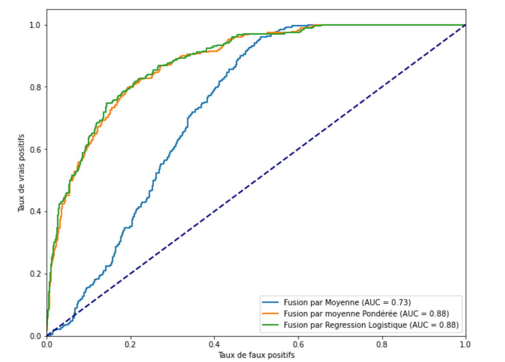

# README - Classification d'images pour l'aide au diagnostic des cancers cutannés

## Description du Projet
Ce dépôt contient les scripts développés dans le cadre d'un stage de recherche au **Laboratoire d’Informatique et Système (LIS), Marseille, France**. L'objectif principal est de concevoir et d'évaluer différents modèles de classification pour la détection automatique du mélanome à partir d'images médicales.

## Objectifs du Projet
- Effectuer une **revue de littérature** sur les méthodes de classification du mélanome.
- Développer des modèles de classification basés sur **KNN, SVM et CNN** (dont **EfficientNetB0**).
- Expérimenter **différentes stratégies de fusion** de modèles (moyenne, pondérée, régression logistique).
- Évaluer les performances des modèles avec des **courbes ROC et métriques de classification**.

## Structure du Dépôt
```
/README.md                       # Description du projet
/data                            # Données d'entraînement et de test
/scripts                         # Scripts d'entraînement et d'évaluation
    |-- CNN_EFFNETB.py           # Implémentation d'EfficientNetB0 préentraîné
    |-- CNN_fromScratch.py       # Implémentation d'un CNN from scratch
    |-- Fusion_cnn_knn.py        # Fusion d'un CNN préentraîné et d'un KNN
    |-- fusionPonderee_SVM_EFFNET.py # Fusion pondérée SVM + EfficientNetB0
    |-- KNN_Melanoma.py          # Modèle KNN pour la classification
    |-- SVM_Melanoma.py          # Modèle SVM pour la classification
    |-- resultats.py             # Génération des courbes ROC et analyses de performance
/models                          # Modèles entraînés
/results                         # Résultats des prédictions et évaluations
/rapport_et_presentation         # Rapport de stage et powerpoint
```

## Technologies Utilisées
- **Langage** : Python
- **Bibliothèques Principales** :
  - `TensorFlow / Keras` pour les réseaux de neurones convolutifs (CNN)
  - `scikit-learn` pour SVM et KNN
  - `matplotlib` & `seaborn` pour les visualisations
  - `pandas` & `numpy` pour le traitement des données

## Installation et Prérequis
### 1️⃣ Cloner le dépôt
```bash
git clone https://github.com/EstelleFingoue/classification-melanome.git
cd classification-melanome
```

### 2️⃣ Installer les dépendances
Créer un environnement virtuel et installer les packages requis :
```bash
python -m venv venv
source venv/bin/activate  # Sous Windows : venv\Scripts\activate
pip install -r requirements.txt
```

##  Utilisation
###  Entraîner un modèle
- Exemple avec EfficientNetB0 :
scripts/CNN_EFFNETB.py 

###  Tester un modèle
- Exemple avec KNN :
scripts/KNN_Melanoma.py

###  Générer les courbes ROC
 scripts/resultats.py 


## Meilleure Courbe ROC

La meilleure performance a été obtenue avec la fusion des modèles. Voici la courbe ROC correspondante :



